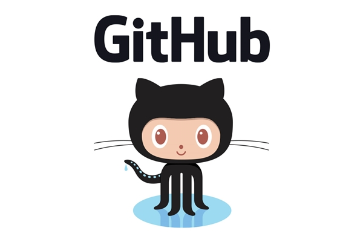
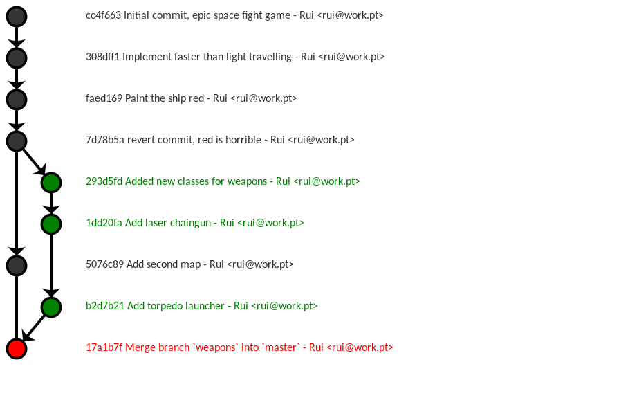

class: middle, center, inlineimg

 

@equalsraf

---
class: middle, center
# about.me
---
class: middle, center
# about.you

---

# Why version control

- Duh, lots of people working on the same code
- Stores your code: history of **Who** did **What** and **When**!
- Fine grained control of changes
  - Messed up? **revert**
  - **merge** code from different people
- Prevents heart attacks. Developer safety net.
- Back in the 80s we used ...

---
class: inverse, middle

# rule**#1** 

don't spend more time managing code than coding


---

# Work is a flow of changes (aka commits)


sometimes we make mistakes!

---
# Work in multiple things at the same time





---
class: middle, center, inverse

# Git

---

# git history in one slide

1. In 2005 Linus Torvalds needed a version control system for the kernel - fast and safe
2. Someone else wanted git to support a workflow for **[RANDOM WORKFLOW HERE]**
3. Repeat step 2. for ~10 years

**Result:** git supports lots of workflows, Google git? About 1,200,000,000 results

---
class: bottom, right
background-image: url(scared.jpg)
## scary for new users
---

# Keep calm and Don't be a wuss

- git has 125 commands (or 38 depending how you count)
- **I know** 26 well
- I never use them all in the same project
- New users can survive with <12

---

# Why maintainers want git?

- disk space efficiency
- weird workflows, git over email, or carrier pidgin
- awesome tools for merge and migration
- security - commits hashed and signed, if the code is tampered
  with you can tell
- Anyone tried deploying SVN over HTTP? PITA!

---

# Why developers want git?

- there are some awesome tools around it, Github, gitstats
- **local patch management** local commits/branches
- i.e. you don't pollute the remote repo with code that is not ready
- Karma - don't commit 3k lines of code with a comment 'Does stuff'

---

# Git is not SVN

- SVN offers a subset of Git
- SVN+Quilt+(??) == Git

## Extra confusion because

- git commit != svn commit
- idem, git checkout
- git pull ...

---
# git pull is the devil

- pull = fetch + merge
- fetch is harmless, merge is not
- In projects where I am the maintainer, git-pull
  is forbidden, use rebase instead

---
class: middle, center, inverse
# git intro


---

# Terminology

**Commit**: is a change in one or more files, with a helpful message

**Branch**: A sequence of commits. Usually each .branch[branch] matches a flow of work (e.g. bugfix, or new feature)

**Remote**: Remote git .remote[server]

Convention: .branch[master] is the main development branch and .remote[origin] is the default server
where you push/fetch

---
class: middle, center

# less talk, show me the real deal!

---
background-image: url(git-flows.png)

---

# Getting started

Create a new repo

```
git init
```

Clone an existing repo

```
git clone https://github.com/equalsraf/git-talk-2015.git
```

---

# Commit changes

Add files to the index

```
git add file.js
```

There is also *rm*, *mv*, etc

---

# Commit changes (2)

Watch where you step

```
git status
```

To see changes that are **NOT** in the index

```
git diff
```

To see changes that **WILL BE** commited

```
git diff --cached
```

---

# Commit changes - finally

```
git commit
```

*$EDITOR* will open, karma mandates you write an informative message. Check the new
commit with

```
git log
```

---

# Branches

Create branch .branch[fix] from .branch[master]

```
git branch fix master
```

Switch to branch .branch[fix]

```
git checkout fix
```

---

# Branches are cheap

Need to star working on something just `git branch`

.branch[tb-refactor]
.branch[fix-1749]

It is not unusual to have 5-10 branches in my repos.

If you are lazy

```
git checkout -b <new_branch_name> <from_branch>
```

---
class: center, middle
# so far, all this is **local**

---

# Push our code to a remote server

Create a new remote called .remote[origin] (git clone does this)
```
git remote add origin https://equalsraf@github.com/equalsraf/git-talk-demo
```

Push the .branch[master] branch into the remote .remote[origin]
```
git push origin master
```

By default the remote branch will show up as .remote[origin/master]


---

# git merge

Turns this


into this


---

# git merge **~~can~~ will fail**

- e.g. two people write in the same file
- git will try to be smart about it
- if it can't merge, it will ask **you** to do it!
- The definition of **you** depends on the project
  - The original developer
  - A maintainer along the way

---
# git rebase

Turn this


into this


the result is similar to merge, **but maybe not**

---

# for magic call **git rebase -i**

- Squash commits together
- Remove commits
- Alter commits
- Great for cleaning up a long branch

**Disclaimer** if you erase all your code it is your fault, not mine!

---
class: bottom, left
background-image: url(cherry.jpg)
background-size: contain
# git cherry-pick
---
# git cherry-pick

Apply **individual** commits from other branches


---
class: inverse, middle
# rule#2
Don't rewrite history, for changes you already pushed into a remote public branch

---
class: middle
# rule#2: (...) hint: Updates were rejected because

---
class: middle, left
background-image: url(revert.gif)
# git revert


---
background-image: url(hooks.jpg)
class: right, middle, inverse, leftbg
# git hooks

---

# .gitignore 

```
# hidden files
.*
# backup files
*.bak
# dont ignore .gitignore :D
!.gitignore
# Objects files
*.class
*.o
```

---
# git add: patch mode

Changed a file but only want to commit some parts

```
git add -p file
```

---
class: bottom, left, inverse
background-image: url(blame.png)
background-size: contain
# git blame

---
class: bottom, right, inverse
background-image: url(reflog.jpg)
background-size: contain
# git reflog

---
class: bottom, right
background-image: url(stash.jpg)
# git stash

---

class: bottom, right
background-image: url(github.jpg)

---

# Why github

1. home to lots of open source projects
2. self promotion
3. find what you need and DRY
4. Social (star, follow, etc)

---
# Why github: Yay free tools

- Git
- Issue Tracker
- Wiki
- Code review
- Static webpages

---

# Pull requests

- In github you can't push to other people's repositories
- You fork their repos, and send [pull requests](https://github.com/neovim/neovim/pull/1927) with changes
- The maintainer may ask for more fixes, or for a rebase

---
class: inverse, middle

# rule#3
ALWAYS create a separate branch for a new PR

---

# Third-party tool integration

- Mail/IRC/XMPP
- Gitter/Slack
- [Waffle.io](https://waffle.io/neovim/neovim)
- Automatic deployment
- a lot more, or write your own

---
# Third-party tool integration

- [Travis-ci](https://travis-ci.org/neovim/neovim) (Linux/Mac)
- [Appveyor](https://ci.appveyor.com/project/equalsraf/neovim) (Windows)
- [Coveralls.io](https://coveralls.io/r/equalsraf/chan42)
- [Scrutinizer](https://scrutinizer-ci.com/)
- Coverity

---

# Github things that don't work so well

- Notifications get lost easy
- Rebase may re-trigger notifications from 2 months ago
- Distinction issues/PR makes it harder to find stuff
- Issue tracker labels could be ... so much better

---

# Other stuff

- there is also Bitbucket
  - less people
  - unlimited private repos (for 5 users)
- github student accounts
- gitorious, gitlab
- or the competition (Mercurial)
- git-svn (i.e. svn remotely git locally)

---

# Things you should check out

- [Git book](http://www.git-scm.com/book/en/v2)
- [Successful Git branching model](http://nvie.com/posts/a-successful-git-branching-model/)
- [Git Koans](http://stevelosh.com/blog/2013/04/git-koans/)
- [A better pull request](https://developer.atlassian.com/blog/2015/01/a-better-pull-request/)

---

# Free advice

- Stay away from crappy IDE integration
- Disable automatic code reformatting
- There are good Git GUIs (gitk is not!)
- When doing cross platform development, Google for CRLF git issues
- Git sucks at storing large binary files

---
class: center, middle, cover
background-image: url(engine.jpg)
# git: under the hood

---
# I need to know how it works inside!

- Technically Git is a content based Database
- Stores objects identified by a **hash** of their content
- branches are just a file with a hash inside
- If you are into FS based caches
```
ls -l .git/objects
```

---
# I need to know how it works inside!

The git history is a Directed Acyclic Graph


Each commit holds the hash of its parent


```
tree 2704b87e103fe924b84cbf1a91c80d3f01df3219
parent 6c6dce9ca13a3b2c029fd2e362adff7b2f77f8cb
author Rui Abreu Ferreira <raf-ep@gmx.com> 1424249557 +0000
committer Rui Abreu Ferreira <raf-ep@gmx.com> 1424249557 +0000
```

---

# Things we didn't talk about

tags, mergetool, aliases, crazy repo backups, reset, submodules, clean, how to remove remote branches, fsck, config, --ammend, whatchanged, hosting your git server, filter-branch

---
class: dark, middle, right
background-image: url(guiness.jpg)

# Q&A
@equalsraf
bye


